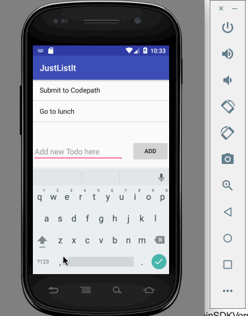

#Pre-work - JustListIt

JustListIt is an android app that allows building a todo list and basic todo items management functionality including adding new items, editing and deleting an existing item.

Submitted by: Dharini Chandrasekaran

Time spent: ~2 hours spent in total

## User Stories

The following **required** functionality is completed:

* [x] User can **successfully add and remove items** from the todo list
* [x] User can **tap a todo item in the list and bring up an edit screen for the todo item** and then have any changes to the text reflected in the todo list.
* [x] User can **persist todo items** and retrieve them properly on app restart

## Video Walkthrough

Here's a walkthrough of implemented user stories:

GIF created with [LiceCap](http://www.cockos.com/licecap/).

## Project Analysis

As part of your pre-work submission, please reflect on the app and answer the following questions below:

**Question 1:** "What are your reactions to the Android app development platform so far? Compare and contrast Android's approach to layouts and user interfaces in past platforms you've used."

Android's development platform, while constantly improving, has the major drawback of market fragmentation. From what I have tried before and read about, the typical app developer is forced to use support libraries constantly which makes it a pain to utilize the latest features in a clean manner. Additionally, the wide varierty of manufacturers and quirks in their screen dimensions forces hobby developers to spend an inordinate amount of time making sure that the UX looks great on multiple screens. 

The pre-packaged emulator is slow and clunky. Options like Genymotion, while being the indurstry standard are expensive for the hobby developer. I find it easiest to use a cheap developer phone and then only use the emulator for UX tweaks on larger screen sizes.

**Question 2:** "Take a moment to reflect on the `ArrayAdapter` used in your pre-work. How would you describe an adapter in this context and what is its function in Android? Why do you think the adapter is important? Explain the purpose of the `convertView` in the `getView` method of the `ArrayAdapter`."

An adapter can be thought of as a translator. On the one hand we have raw data, in this case plain strings that are stored in an array. On the other, we have a ListView which is the final representation we desire for the users to see and interact with. Adapters give us the functionality of translating this raw data into Views that can be utilized by the ViewGroup we desire to show our end users. In the basic app, we use a straightforward ArrayAdapter, which converts String arrays into TextViews to be used in a simple ListView. But we can create more complicated, custom views from different data sources using a custom adapter by overriding the getView method.

The convertView parameter in the getView method of ArrayAdapter allows us a chance to 'recycle' views. Android has a component called Recylcer which keeps track of what is being shown on the screen. This allows applications to reuse previously created views that are not currently being rendered on the screen. The convertView parameter is passed in by the system when a View has been created that is no longer being used. The getView method should just reset the data in this View instead of creating a new View. This will improve application performance as creating new Views is an expensive operation. Additionally, it does not make sense to keep creating Views when they are not being used as they will simply occupy additional memory.

## Notes

Describe any challenges encountered while building the app.

This basic version did not pose many challenges, I will update this section once I add more functionality to the application.

## License

    Copyright 2017 Dharini Chandrasekaran

    Licensed under the Apache License, Version 2.0 (the "License");
    you may not use this file except in compliance with the License.
    You may obtain a copy of the License at

        http://www.apache.org/licenses/LICENSE-2.0

    Unless required by applicable law or agreed to in writing, software
    distributed under the License is distributed on an "AS IS" BASIS,
    WITHOUT WARRANTIES OR CONDITIONS OF ANY KIND, either express or implied.
    See the License for the specific language governing permissions and
    limitations under the License.
